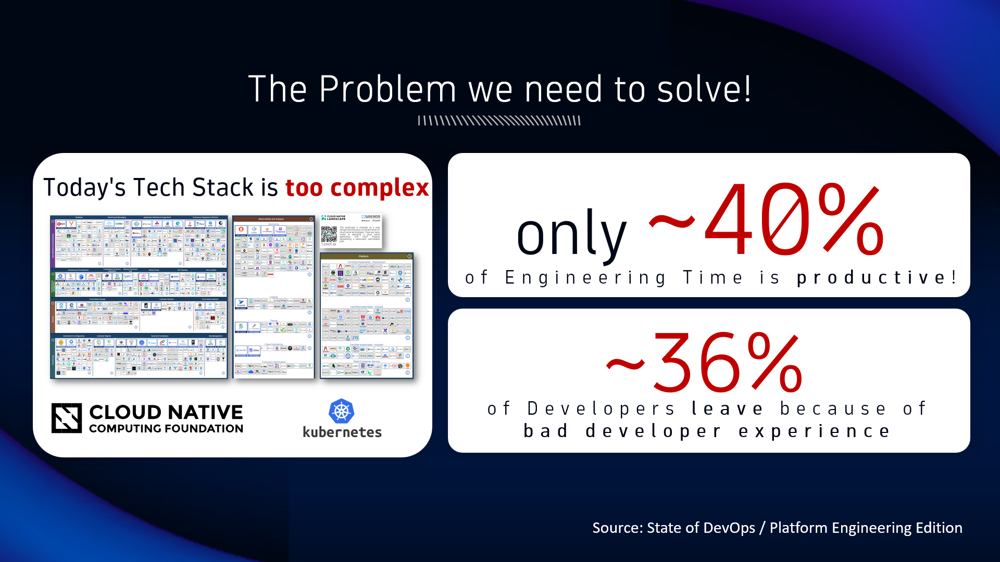

## Problem Statement

Based on the State of Platform Engineering Report, development teams struggle with the complexity of the ever evolving tool and technology stack; including the expansion of their responsiblites from developing code to owning the end-2-end lifecycle.

To learn more 
* Read and watch the video on [What is Platform Engineering!](https://www.dynatrace.com/news/blog/what-is-platform-engineering/)
* Download the [State of DevOps Report](https://www.puppet.com/success/resources/state-of-platform-engineering)