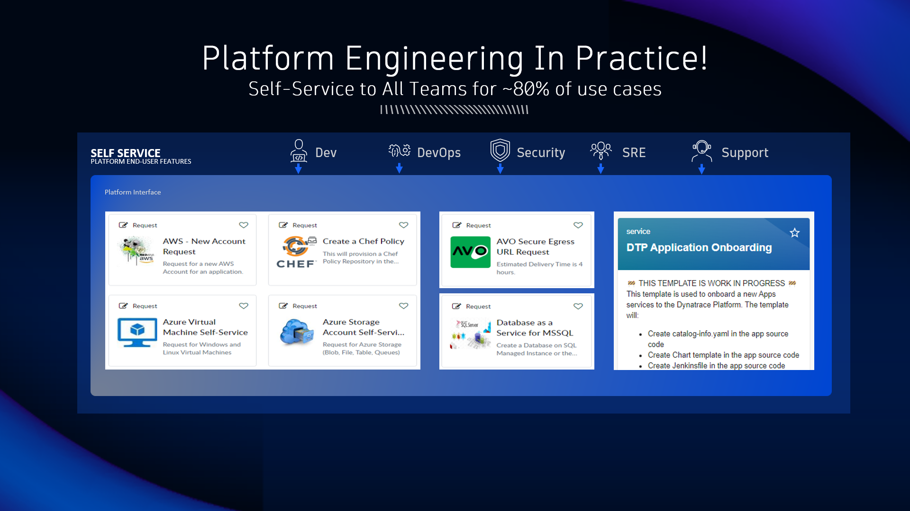

## Platform Engineering

### What is Platform Engineering?

### Platform Engineering in Practice

These are examples of organizations providing self-service platforms for engineering teams to reduce the manual effort of building, testing, deploying and operating software!

To learn more 
* Read and watch the video on [What is Platform Engineering!](https://www.dynatrace.com/news/blog/what-is-platform-engineering/)
* Download the [State of DevOps Report](https://www.puppet.com/success/resources/state-of-platform-engineering)