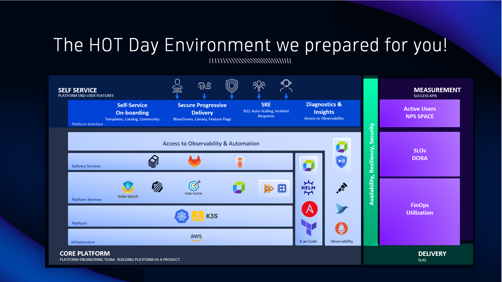
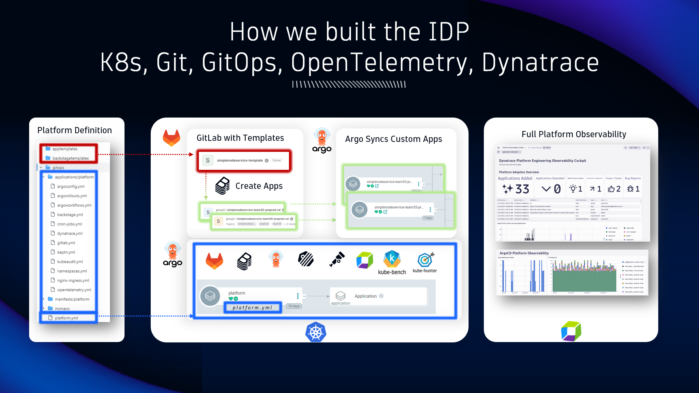

## HOT Day Environment

### The HOT Day environment we prepared for you

Based on the Reference Architecture we built a platform that provides
- Self-Service Onboarding of a new application
- Automated Deployment
- Automated Observability
- Automated Release Validation
- Automated Notifications
- Automated Security

The key tools in this platform we will be interacting with are
- Backstage: Our Platform Portal
- GitLab: Our Git version system
- ArgoCD: Our GitOps deployment framework
- Dynatrace: Our observabilty & security platform
- K3s: Our Kubernetes Platform

### How we built the IDP

Our platform follows the GitOps model where EVERYTHING - Platform and Services - are deployed through ArgoCD.

Our Platform and its components (backstage, dynatrace, opentelemetry, keptn, ...) is defined in Git and will be deployed by ArgoCD.

When onboarding a new application a new Git repository is created based on a template which is then also deployed by ArgoCD.

Everything that is deployed on that target K8s cluster is fully observed with Dynatrace.