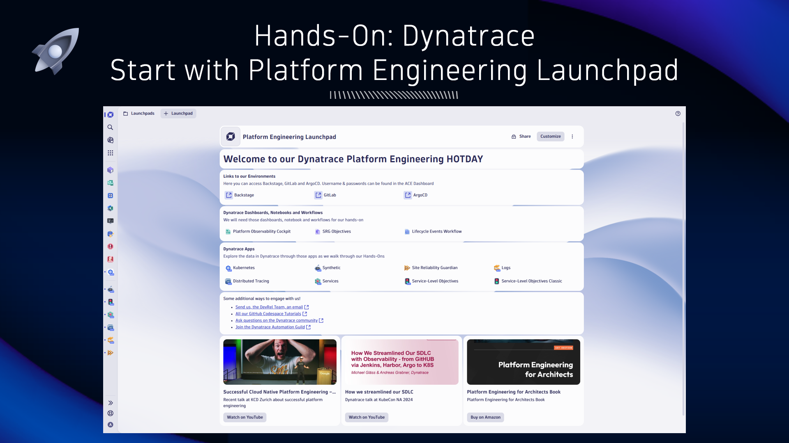
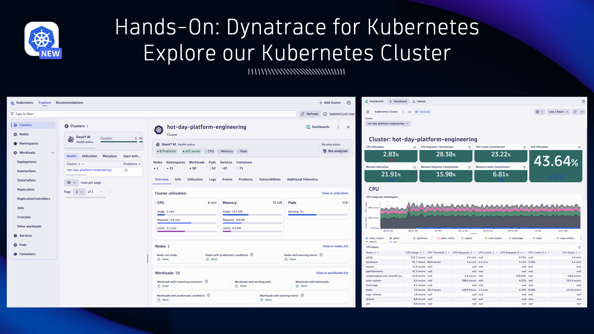
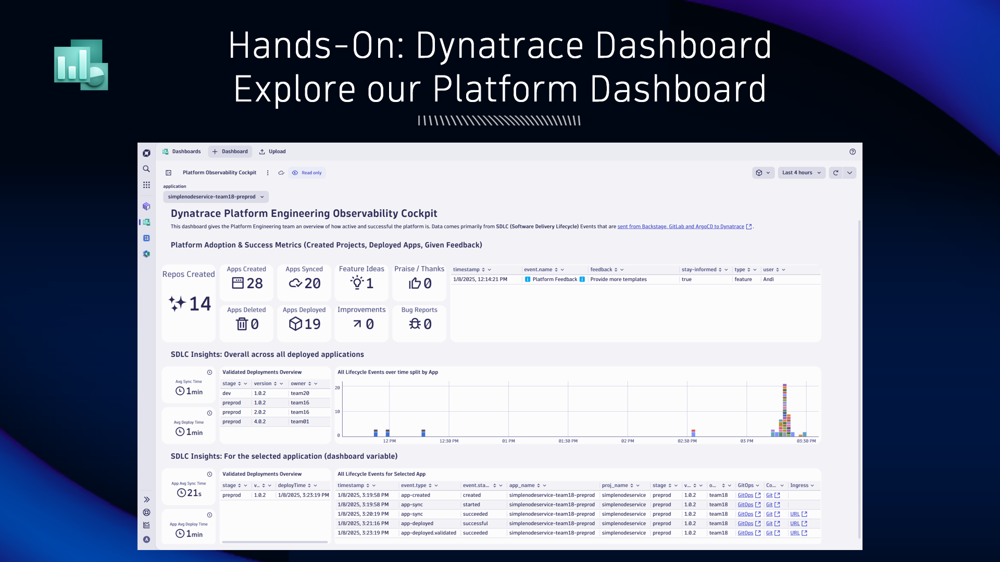

## Hands-On: Dynatrace

### Start with Platform Engineering Launchpad

Dynatrace Launchpads provide a customizable start page designed to improve your user experience.  They allow you to consolidate relevant content, provide drill downs into different areas of the platform, and make team collaboration much easier.

We have prepared a Launchpad for you with all relevant links. This includes links to our tools such as Backstage, GitLab, Argo as well as links to Dynatrace Dashboards and apps we will need today.

Additionally, you'll find links to more information about Platform Engineering and how to learn more.

**What you have learned:**
Dynatrace LaunchPads are a great way to provide a customized experience when starting your work with Dynatrace.

Want to learn more? [Launchpads (Doc)](https://docs.dynatrace.com/docs/discover-dynatrace/get-started/dynatrace-ui/launchpads)

### Explore our Kubernetes Cluster

Let's quickly validate that Dynatrace is properly monitoring our Platform Kubernetes Cluster. For this we open the Kubernetes App.

Lets validate that we have no issues across all layers of Kubernetes (cluster, namespaces, workloads ...).

We can also explore the ready-made dashboards to get more insights into e.g: Cluster health

**What you have learned:**
Dynatrace comes with an out-of-the-box Kubernetes Observability Experience that includes an App and several ready-made dashboards!

Want to learn more? [Unlocking Kubernetes Insights (YouTube)](https://www.youtube.com/watch?v=Qxt3XAMJNhA)

### Explore our Platform Dashboard

This is a custom built dashboard that gives us insights into how our platform is used and adopted. Most of this data comes from Software Delivery Lifecycle Events (SDLC Events) that are sent to Dynatrace from Backstage, GitLab and ArgoCD. We will learn more about how this data gets send to Dynatrace and how we can analyze it.

For now we want to make sure you know that this dashboard gives us an overview of how many applications have been onboarded and deployed through our platform. We will come back to this later!

**What you have learned:**
You can build customized dashboards in Dynatrace to make relevant data easy accessible.

Want to learn more about Dashboards? [Dashboards (Doc)](https://docs.dynatrace.com/docs/analyze-explore-automate/dashboards-and-notebooks/dashboards-new)