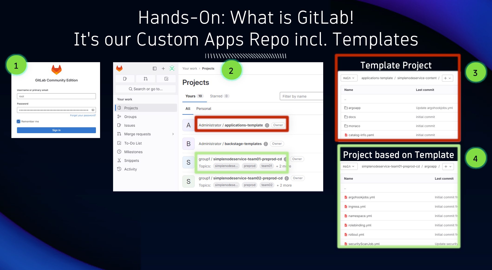

## Hands-On: GitLab

### GitLab: Our custom apps repo including templates

In our platform we use GitLab. All of this would also work with GitHub, Bitbucket or any other Git-based systems. 

**Logon to GitLab**
To logon to GitLab you need username and password from the ACE Dashboard.
BE AWARE that you will be logged in as `root` which is a power user that has full priviliges. DO NOT DELETE anything as this may break the experience of our training!

**What's in the repo?**
In our Git system we have template repositories that we will later use to create and onboard new applications. 
Lets just have a quick look into those repos so that we later better understand whats happening! You will find manifests, monaco and files needed by backstage!

**What you have learned:**
That we use Git to define template repositories that include deployment information as well as Dynatrace Monaco configuration. Those templates will later be used when onboarding a new application!