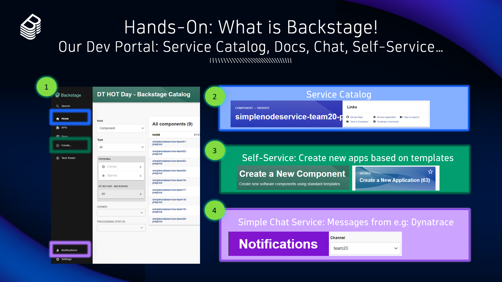

## Hands-On: Backstage

### Backstage: Our developer portal with service catalog for self-service onboarding

In our platform we use Backstage as our Developer Portal - that is: The UI for our engineers to explore existing software services, documentation as well as accessing self-service templates to create new components. 

**Explore Backstage**
We have setup Backstage WITHOUT a login. Once you access the UI you will be able to access the key areas of this customized version of Backstage
- *Service Catalog*: we will later find all our onboarded services
- *API & Doc*: we will not need this in our classroom
- *Create*: this is where we can execute self-service use cases (aka Golden Paths)
- *Notifications*: this is a custom built extension we will use. Its a "simple messaging system". Dynatrace later on will send us messages to keep us up2date on deployments!

**What you have learned:**
Backstage is a popular open source tool that can be used as a developer portal to give easy access to relevant information and self-service for engineering teams.