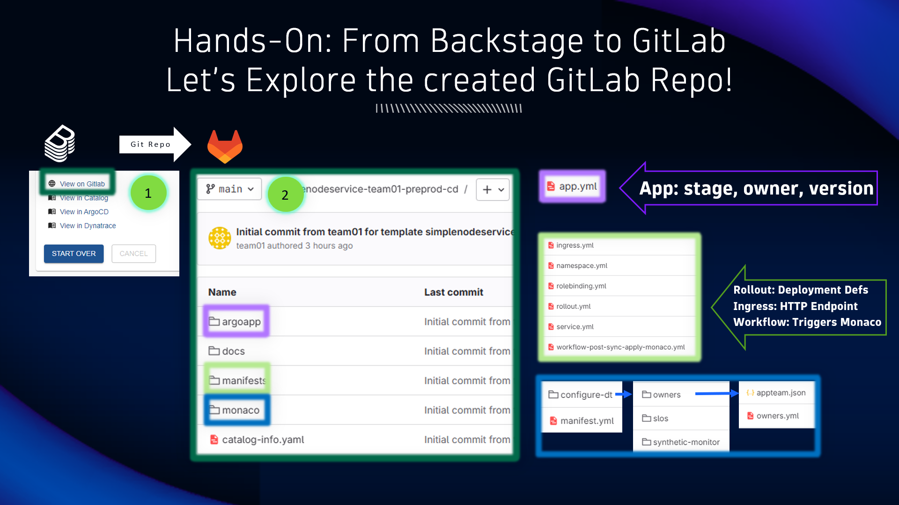

## GitLab: Explore the new Repo

### Let's explore the created GitLab repo 

1. From the Backstage new component page, locate and click on `View on GitLab` to open the newly created GitLab repo

2. Browse the different directories created in the new repo
    - `argoapp` directory contains the stage, owner, and version details of the application managed by ArgoCD
    - `manifests` directory contains the Kubernetes deployment manifests for the application
    - `monaco` directory contains the Dynatrace configurations to be deployed automatically via Monaco (Configuration as Code)
