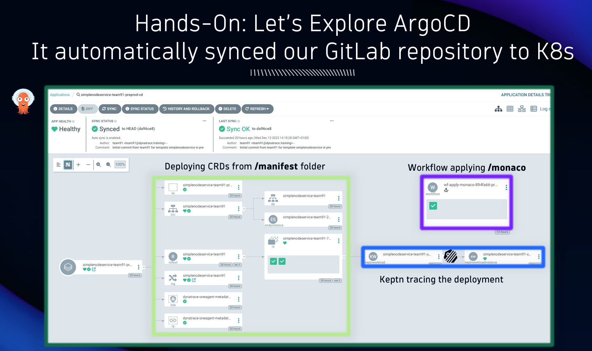

## ArgoCD: Automatic Deployment to Kubernetes

### New component is automatically managed by ArgoCD

1. From the Backstage new component page, locate and click on `View in ArgoCD` to open the newly created app in Argo

2. The repo contains an ArgoCD app manifest, allowing Argo to automatically start managing the app

### It automatically synced our GitLab repository to Kubernetes

The application will be synced automatically, Argo will deploy all of the manifests to the Kubernetes cluster.

Additionally, the Monaco workflow will deploy the supporting Dynatrace configuration items.

Finally, Keptn lifecycle management provides distributed tracing of the different deployment activities.