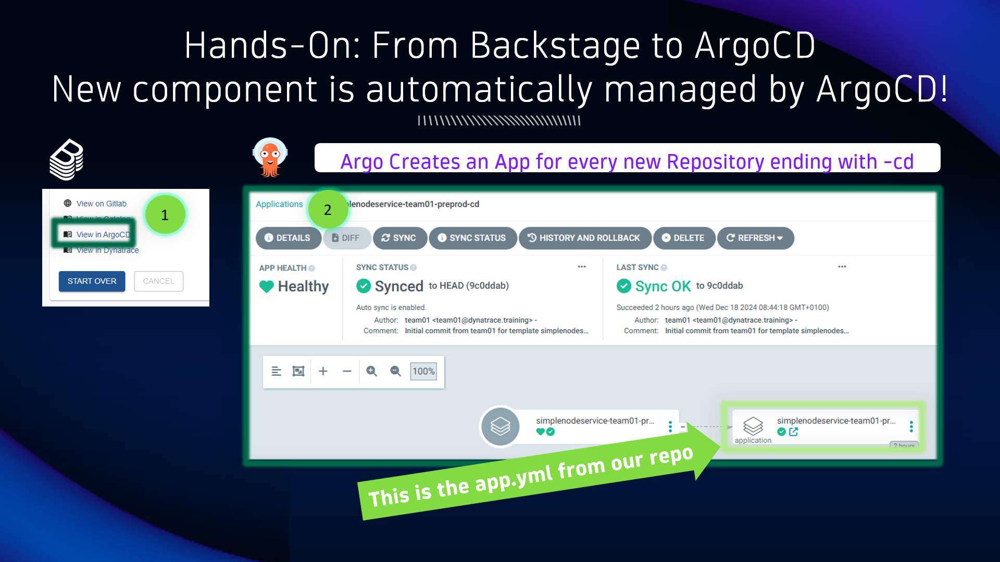

## ArgoCD: Automatic Deployment to Kubernetes

### New component is automatically managed by ArgoCD

1. From the Backstage new component page, locate and click on `View in ArgoCD` to open the newly created app in Argo

2. The repo contains an ArgoCD app manifest, allowing Argo to automatically start managing the app

**Argo Sync with GitLab**
Argo can be configured to either periodically scan (Schedule) the Git repositories for any change - or - a Git system can notify Argo about a change (Webhook).
In our case we have setup Argo with a schedule of 3 minutes. This is why it can take up to 3 minutes for Argo to show your new app