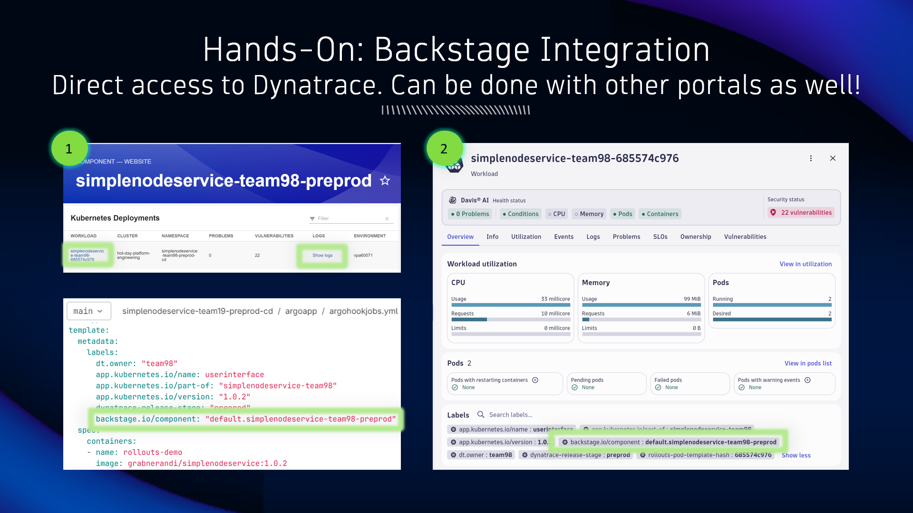
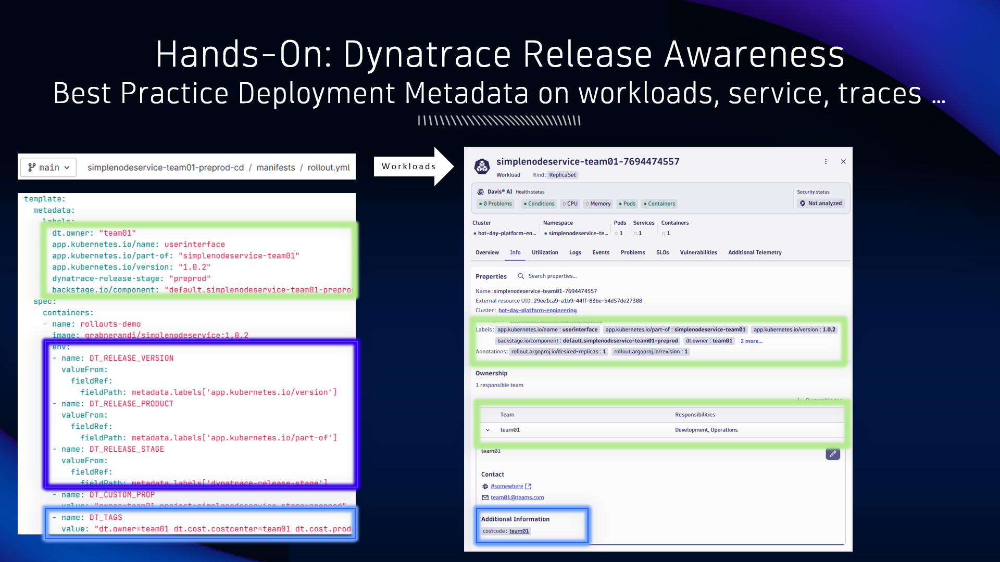
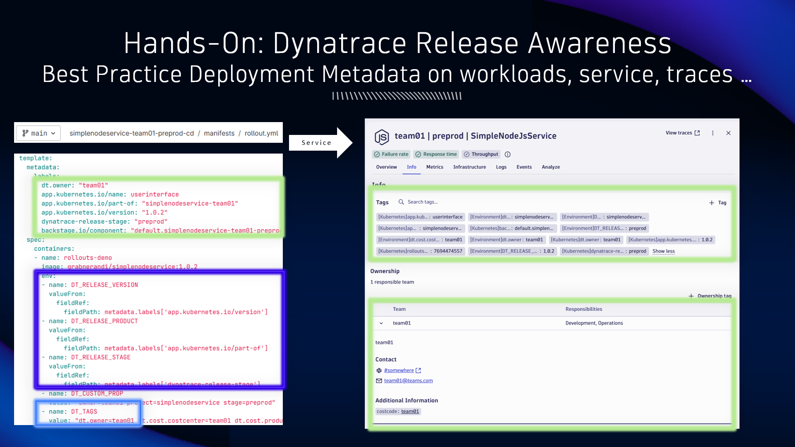
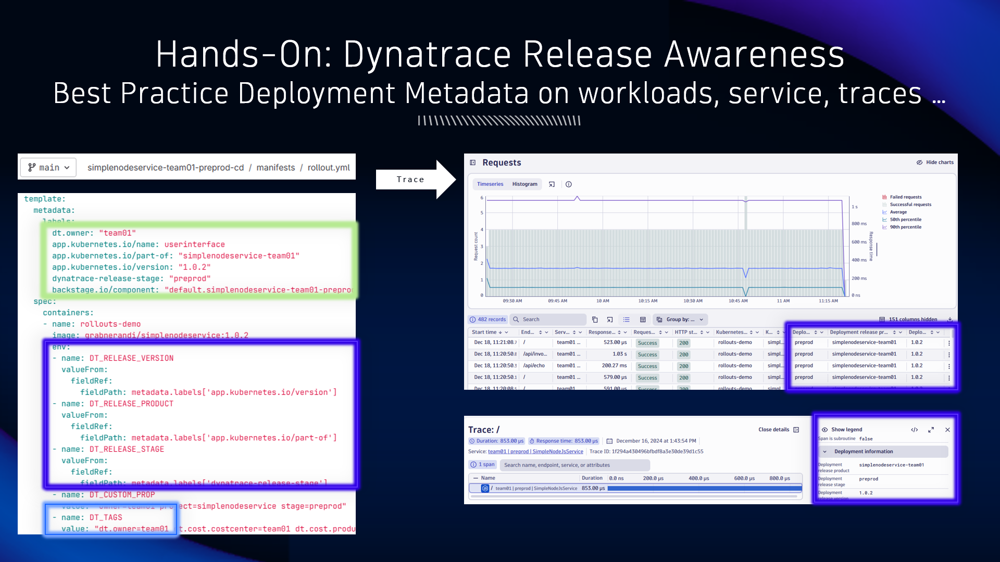
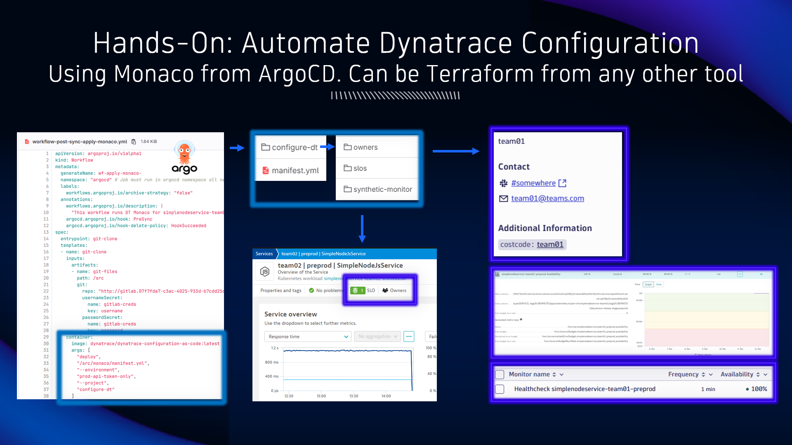
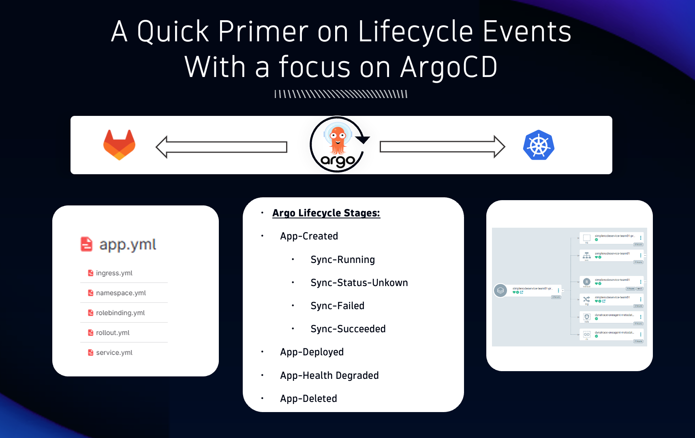
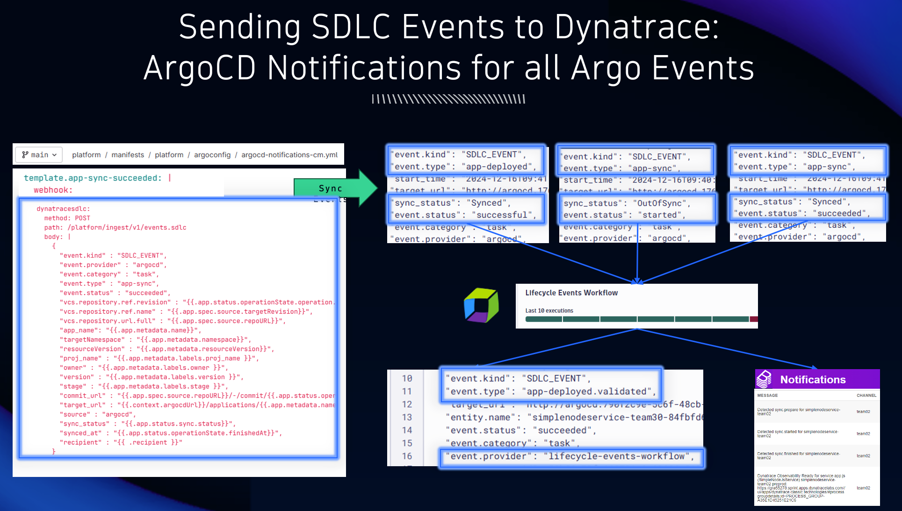
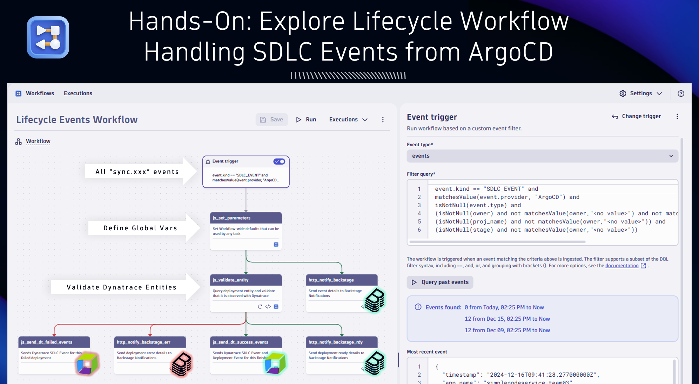
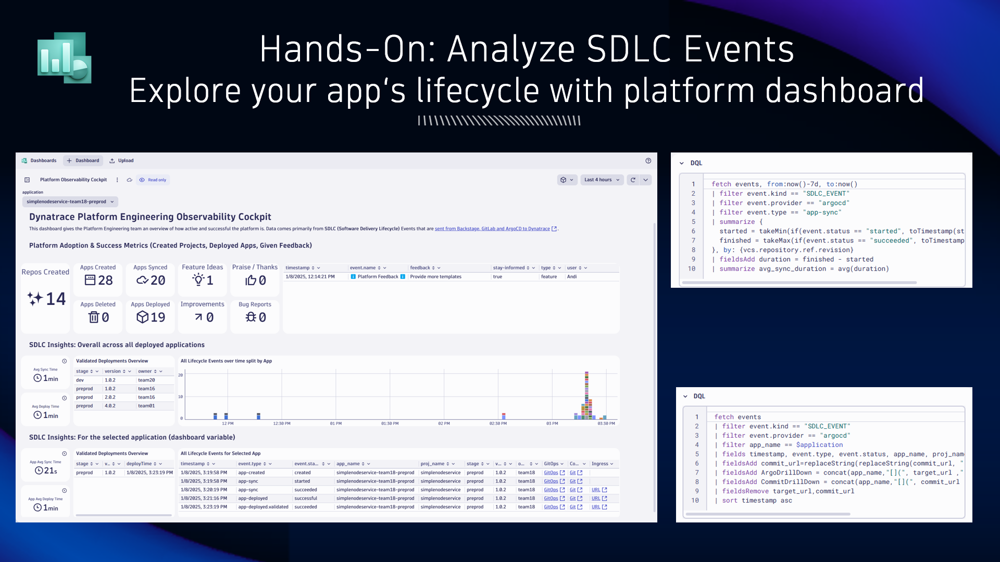
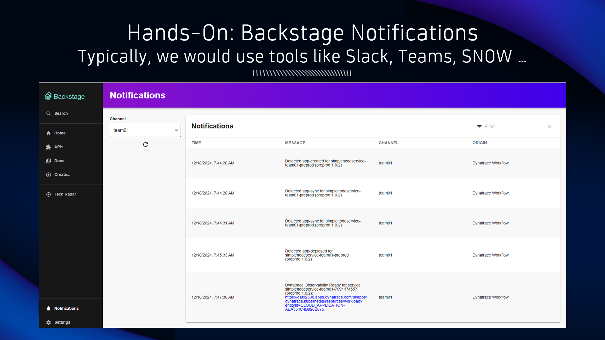

## Dynatrace: Observe the Results

### Backstage Integration: Direct Access to Dynatrace Data

### Dynatrace Release Awareness

### Dynatrace Monaco (Configuration as Code)

### Software Delivery Lifecycle Events

### Backstage Notifications for Closed-Loop Delivery

