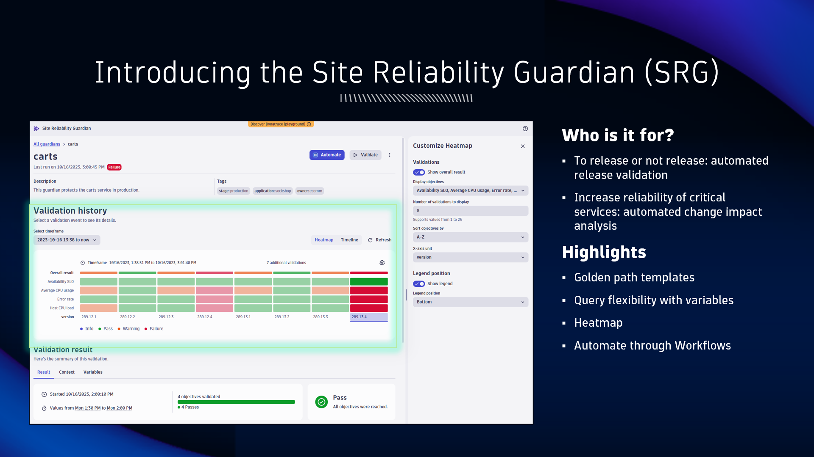

## Site Reliability Guardian

A Dynatrace app that automates release validation to check a newly deployed version's service availability, performance, capacity, and security objectives.

A Guardian is a collection of defined objectives that are evaluated for a specified timeframe to determine pass, warning, or fail status.  An objective is a means for measuring your services such as performance, availability, and security. You can define an objective for your guardian that is validated on demand or automatically.

Guardians are attached to Workflow automations, allowing them to be integrated into your software delivery lifecycle.

Learn moer about the guardian and best practices here
- Read [Site Reliability Guardian (Docs)](https://docs.dynatrace.com/docs/deliver/site-reliability-guardian)
- Watch [Site Reliability Guardian AppSpotlight (YouTube)](https://www.youtube.com/watch?v=4KYZv8YnqQo)
- Watch [Composite Site Reliability Guardian (YouTube)](https://www.youtube.com/watch?app=desktop&v=N1On6Ausukc&t=0s)