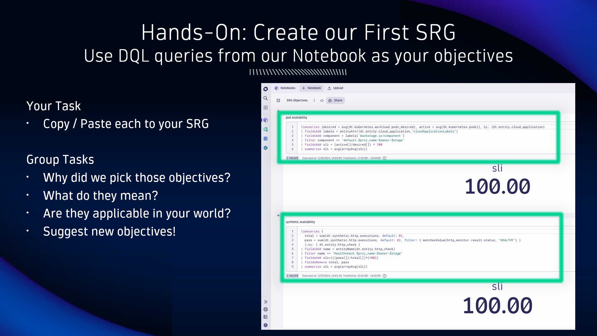

## Create our First SRG

Begin by opening the Site Reliability Guardian App within the Dynatrace environment.

### Tags for organization and automation

1. Click on `+ Guardian` to create a new Guardian

2. SRG provides some great templates to get you started, but today we'll choose `Create without template`

3. Give the Guardian a name, the same as the deployed app name.  Enter a description, such as `release validation for our deployment`.  To integrate the Guardian into the lifecycle on our IDP, specify the following tags:
    - owner = the owner of the deployed app
    - proj_name = the project of the deployed app
    - stage = the stage of the deployed app
    - notify = true

### Variables for dynamic DQL queries in our objectives

1. Next to the Guardian name, click the `...` button and choose `Variables`

2. Specify the variable `name` and variable `value`, then click `Add`

3. Create the following variables:
    - owner = the owner of the deployed app
    - proj_name = the project of the deployed app
    - stage = the stage of the deployed app

4. Click on the `+` button to Add new objective to the Guardian

### Use DQL queries from our Notebook as your objectives

Open the Notebooks App and find the Notebook titled `SRG Objectives`.  This Notebook contains the DQL queries that can be copied and pasted into the Guardian's objectives.  These queries include the variables that were defined in the previous step.

### Define an objective with DQL and static thresholds

1. Give the objective a name.  Guardian objectives support DQL queries and Classic SLO metrics.  Choose `Grail using DQL`.  Paste the query from the Notebook into the `DQL Query` field.  Optionally, you can test the query manually from this screen.  If the query fails, that's OK; it's likely that the deployment needs more time to generate data for that objective.

2. In the `Define thresholds` section, choose `Static thresholds`.  Our queries are all structured so that 100 is perfect and 0 is problematic.  Choose `A higher value is good for my result` with a `Fails if result < 98` and `Warns if result < 99`

3. Click on `Save` to save the Guardian and the objective.

### (optionally) Add the remaining DQL objectives

Guardians require at least 1 objective.  Time permitting, complete the Guardian by adding the remaining 5 objectives, for a total of 6.

