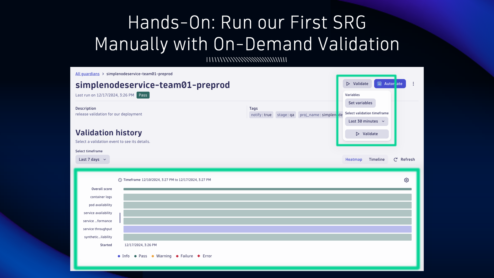
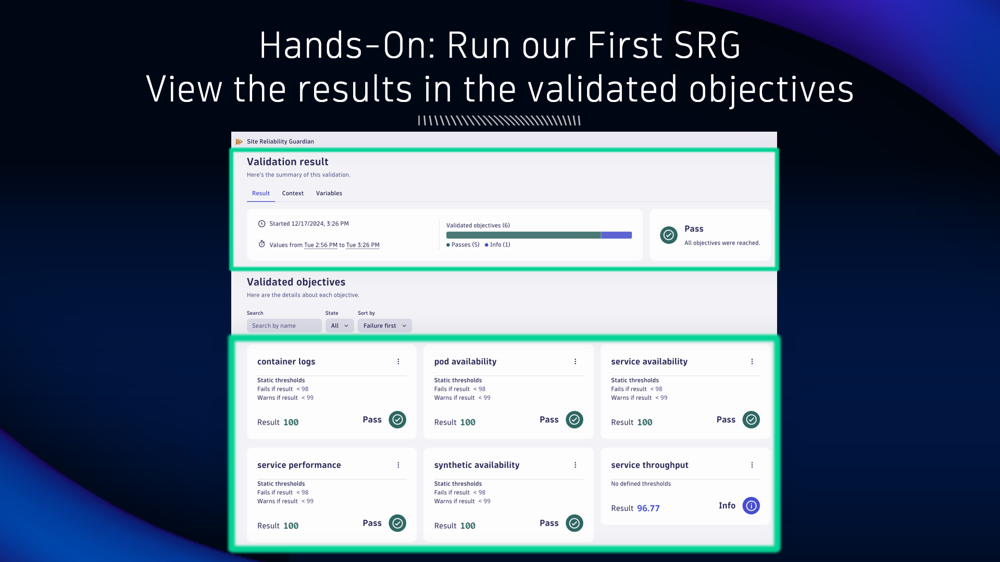

## Run our First SRG Manually

Guardians can be executed manually on-demand or through a Workflow automation.

### Manually with On-Demand Validation

Open your Guardian and locate the `Validate` button in the top right corner.  Click it and choose `Last 30 minutes` for the validation timeframe, then click `Validate`.

The validation results will show up below, shortly.

### View the results in the validated objectives

Below the Validation result, find the Validated objectives.  The result of each DQL query objective for the validation timeframe (last 30 minutes) will be shown.  The result is evaluated against the static thresholds to determine pass, warning, or fail.

The worst evaluated objective result will be used to determine the overall Guardian validation result.  That is to say, if any of the objective results fail, then the validation result is fail.  You can use Automation workflow capabilities or IDP tooling capabilities to apply additional logic and quality gating.