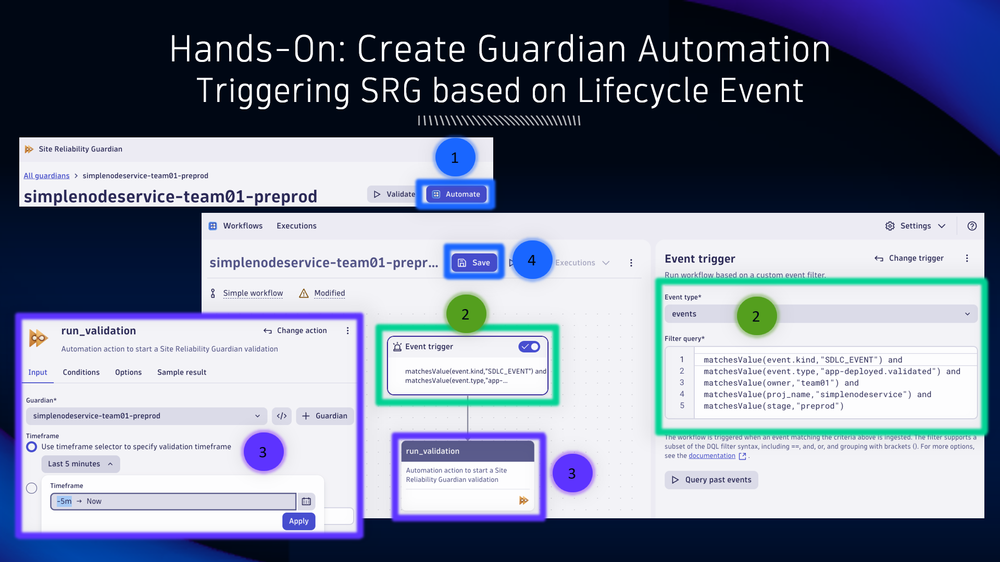
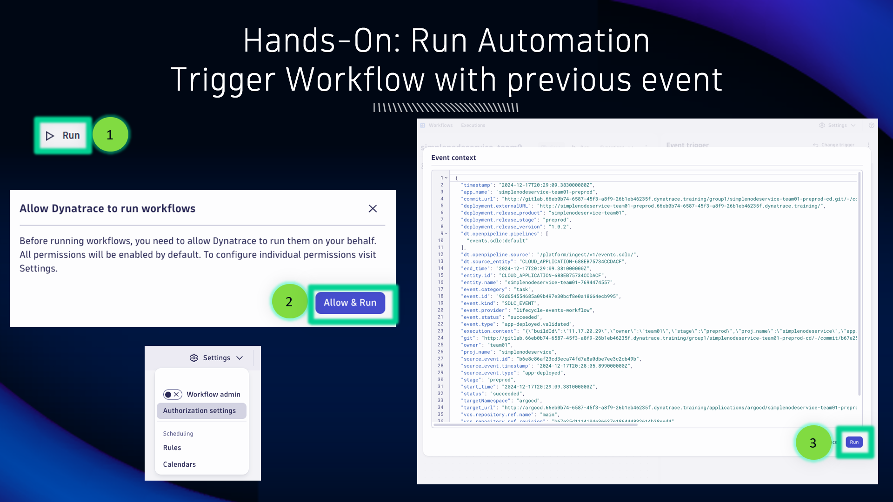

## Automate our SRG Validation

### Best Practices on SRG Workflows


TODO

### Triggering SRG based on Lifecycle Event



1. From the Guardian overview, click on `Automate` to create a new Workflow automation

2. A new Workflow automation will be created with an `Event Trigger` and a Site Reliability Guardian `Task` already configured.  Modify the `Event Trigger` to use `events` as the Event type.  Modify the `Filter query` using the query below:

<!-- DQL -->

```dql
matchesValue(event.kind,"SDLC_EVENT") and 
matchesValue(event.type,"app-deployed.validated") and
matchesValue(owner,"team01") and
matchesValue(proj_name,"simplenodeservice") and
matchesValue(stage,"preprod")
```

<!-- DQL -->

Be sure to replace `owner`, `proj_name`, and `stage` values accordingly!

Click on `Query past events` to see previous events that would have triggered the Workflow.

3. Modify the `run_validation` SRG Task by updating the timeframe to use the Last 5 minutes (`-5m -> Now`)

4. Save the Workflow

### Trigger Workflow with previous event



1. Click the `Run` button to trigger the Workflow execution manually based on a previous event context.

2. The first time you run Workflows with your account as the Workflow actor, you will likely see a message about allowing the Workflow to use your permissions.  When Workflows execute, they execute with a subset of permissions that the actor has.  You can (optionally) configure this under `Settings -> Authorization settings`.  Keep the default for this exercise.

3. When the Event context appears, click the `Run` button to trigger the Workflow execution.


The Workflow should run successfully.  After the execution completes, check the `run_validation` task and look at the result.

It's worth noting that in this current configuration, our Workflow is classified as a Simple Workflow.  Simple Workflows have a limited feature set and do not consume any Workflow licensing.  Simple Workflows include one trigger and one task.  To leverage the full capabilities of Workflows, simply add an additional task to it and Dynatrace will automatically convert it to a Standard Workflow.

[Simple Workflow Documentation](https://docs.dynatrace.com/docs/analyze-explore-automate/workflows/simple-workflow)

### Check the validation result in SRG App


Switch over to the Site Reliability Guardian App and locate your Guardian.  You will now see an additional (new) validation in the Validation history for you to review and analyze.
