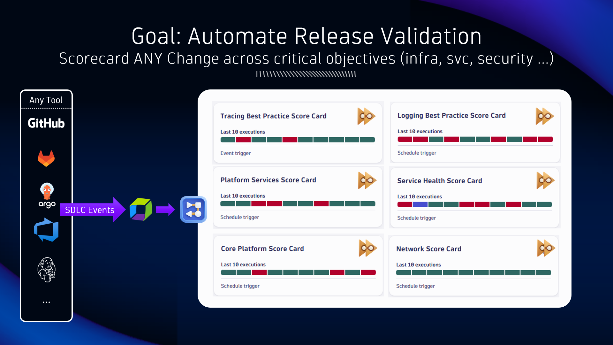
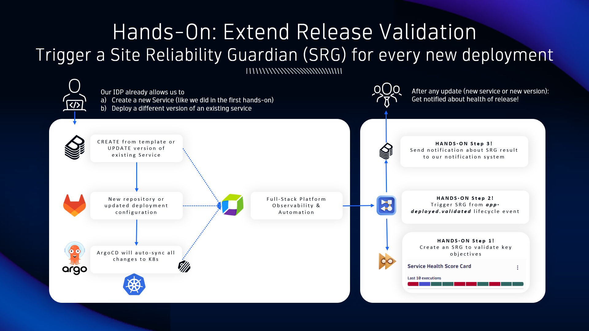

## Release Validation

Our ultimate goal is to validate any change against critical objectives!

Using Site Reliability Guardian and Workflows to automate release validation

* Introducing Site Reliability Guardian (SRG)
* Create our First SRG
* Run our First SRG Manually
* Automate our SRG Validation
* Summary