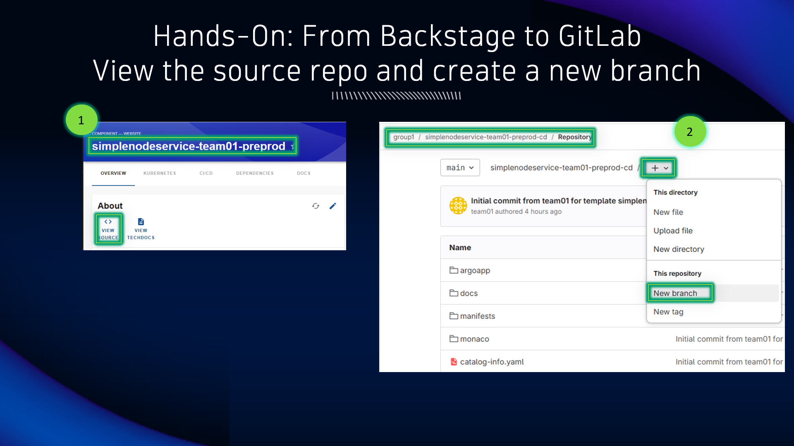
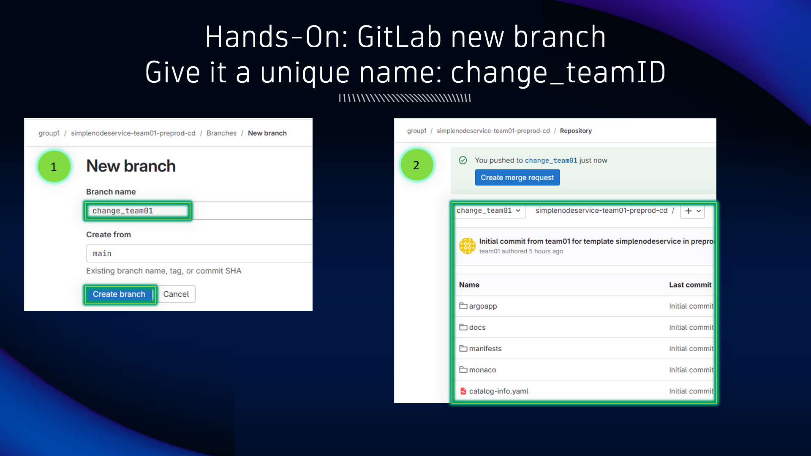
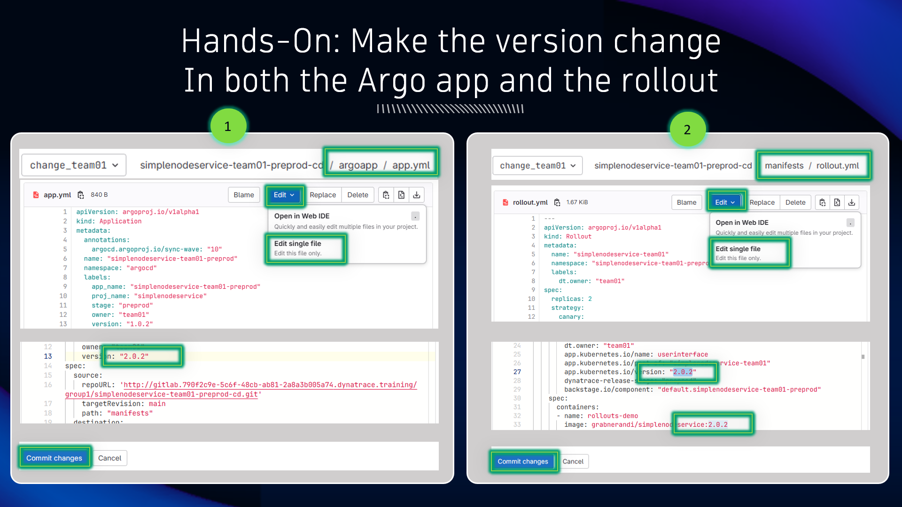

## Create a New Branch

### View the source repo and create a new branch

1. From the Backstage component page, click `View Source` to open the GitLab repo

2. Click on the `+` sign and choose `New branch` to create a new (code) branch on this repo

1. Give the branch a unique name based on your team identifier, i.e. `change_team01`

2. You can now make code (configuration) modifications on this new branch

Make the following changes to the branch:

1. In the `argoapp` directory, locate and edit the `app.yml` manifest.  Locate the `version` label spec and change it from `1.0.2` to `2.0.2`.  Click `Commit changes`.

2. In the `manifests` directory, locate and edit the `rollout.yml` manifest.  Locate the `app.kubernetes.io/version` label spec and change it from `1.0.2` to `2.0.2`.  Locate the `image` container spec and change it from `1.0.2` to `2.0.2`.  Click `Commit changes`.