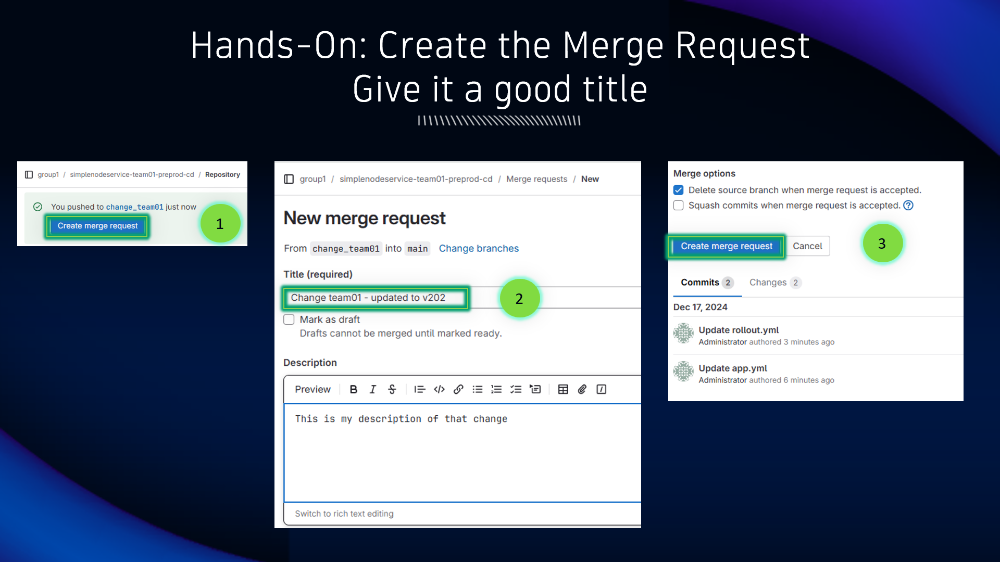
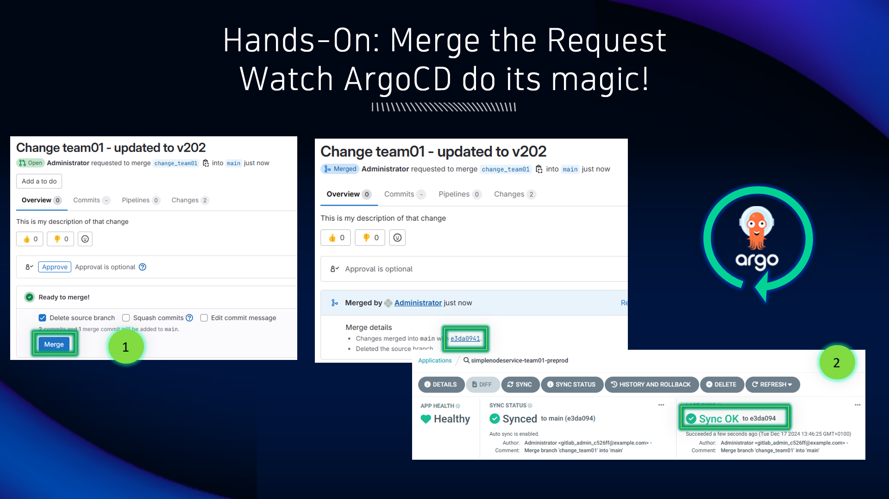

## Submit a Merge Request

### Create a Merge Request

1. Now that the branch is changed, click on `Create merge request`

2. Give the merge request a meaningful name and describe what you've changed

3. Click on `Create merge request` to create a new merge request

1. The merge request is ready to merge, click on `Merge` to merge the new branch with the main branch

2. Navigate to ArgoCD and locate your app.  ArgoCD will automatically trigger a sync when it detects a change to the source.  Optionally, you can click on `Refresh` or `Sync` to speed this up and trigger a new sync

