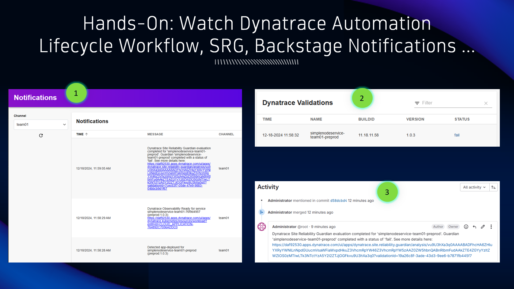

## Dynatrace Automation

### Release Validation feedback

1. From Backstage, navigate to the Notifications page and switch to your team's channel.  As your application's new release progresses, Dynatrace will automatically post messages here.

2. On the Backstage component page, locate the `Dynatrace Validations` section.  Every time the automated release validation takes place, via the Site Reliability Guardian, Dynatrace will store the result and Backstage will display it here.

3. In GitLab, navigate back to your merge request.  When the SRG release validation takes place, Dynatrace will post a message (comment) on the merge request that was submitted to deploy the new release that includes the validation result.