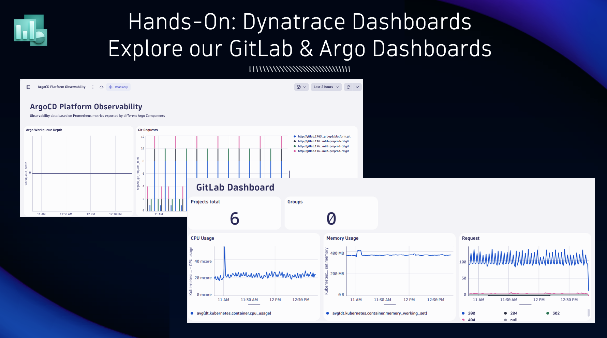
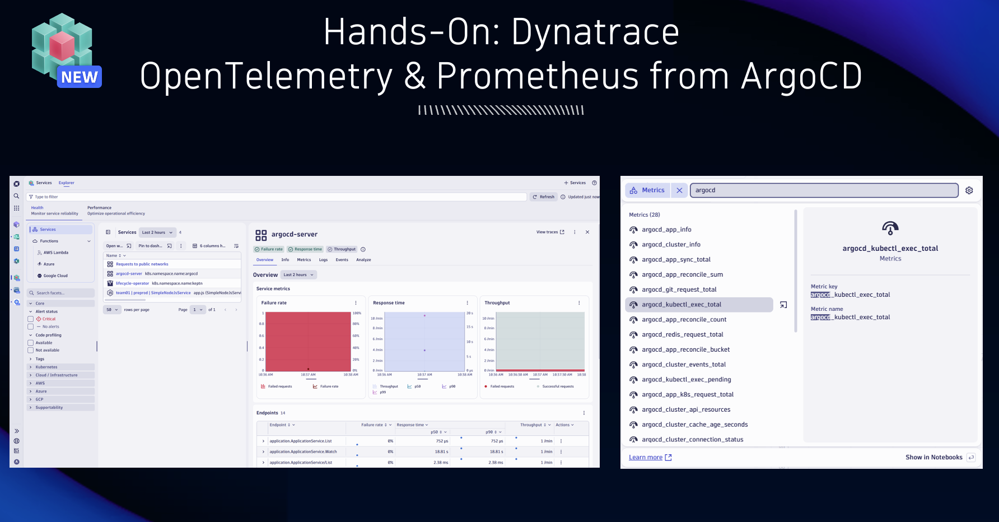

## Additional Hands-On Exercises

We have some additional things for you to do in case you have time

### Explore our GitLab & Argo Dashboards

Explore the additional dashboards we have uploaded to the Dynatrace tenant. Gives you additional insights into ArgoCD as well as GitLab.

### Platform and application logs

Explore all logs that are ingested into Dynatrace using the Logs App. Try to find any errors or patterns!

### Dynatrace Synthetic Tests

Every deployed app as well as all platform components (backstage, gitlab, argo) are automatically monitored with a Dynatrace Synthetic Test. The configuration is pushed out through Monaco

Open the Dynatrace Synthetic app and explore how stable those apps are.

To learn more about Synthetics read [HTTP Monitors](https://www.dynatrace.com/news/blog/simplify-test-management-with-dynatrace-http-monitors/)

### ArgoCD Health with OpenTelemetry and Prometheus

ArgoCD is exposing OpenTelemetry as well as Prometheus data
Find the ArgoCD Service and explore the traces. Also use the global metrics search and find some of the prometheus metrics!