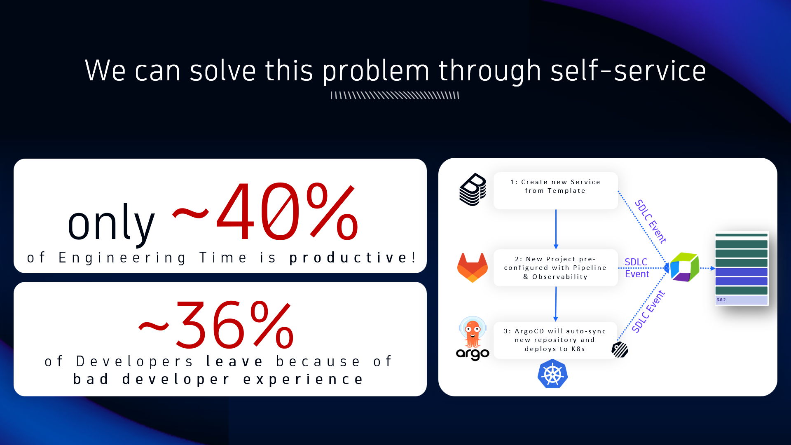
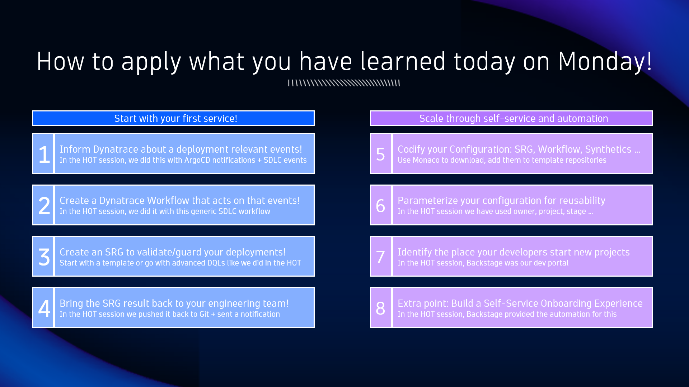
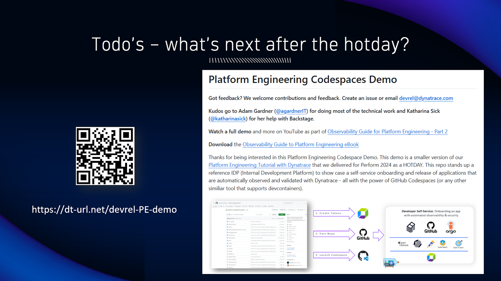

## Wrap Up

We have proven that we have the tools to automate the technology complexity. With this we can achieve higher efficiency of engineering teams which will lead to more productivity.

Dynatrace is a key enabler of this by integrating with all your various Git, build, deploy, ticketing or configuration management tools.

If you want to play around with this reference platform after the training is over you can use a similiar version that is available on GitHub: [Platform Engineering Codespace Demo](https://dt-url.net/devrel-PE-demo)